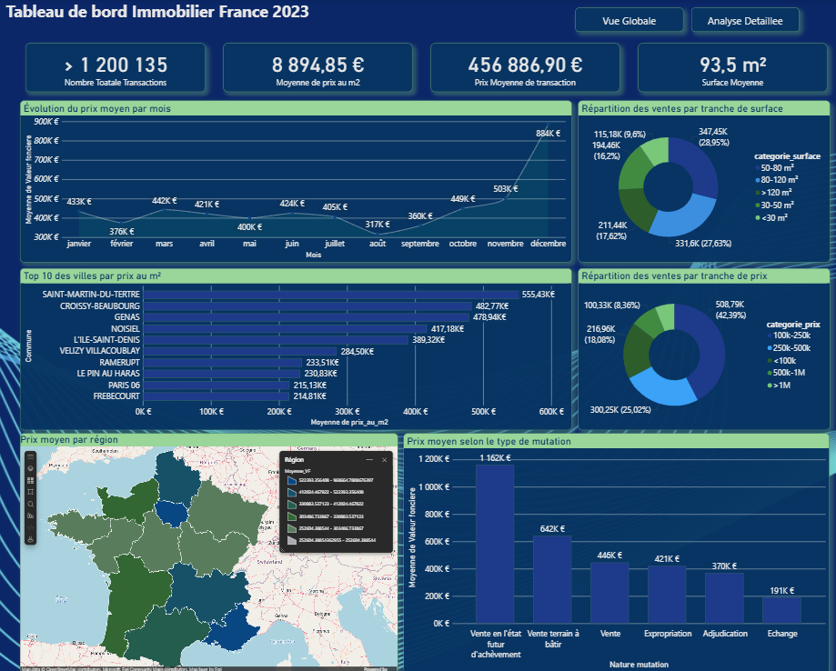
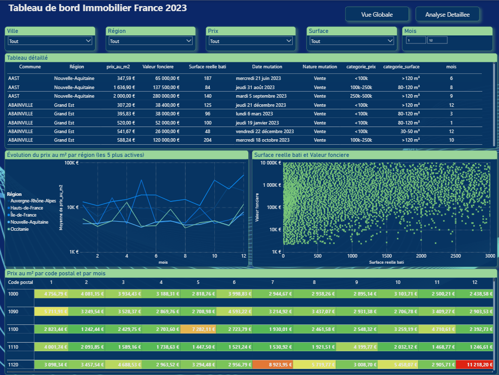

# 🏠 Dashboard Immobilier France 2023

## 📊 Contexte

Analyse du marché immobilier français à partir des données DVF 2023.

## 📈 Données

- **Source** : [DVF 2023 - data.gouv.fr](https://www.data.gouv.fr/fr/datasets/demandes-de-valeurs-foncieres/)
- **Volume** : 1,2 million de transactions après nettoyage
- **Période** : Année 2023
- **Couverture** : France métropolitaine

## 🛠️ Stack technique

- **ETL** : Python (Polars, Pandas)
- **Base de données** : PostgreSQL (pgAdmin, SQLAlchemy)
- **Visualisation** : Power BI

## 📁 Aperçu
Le fichier `.pbix` est téléchargeable 

## 👤 Auteur

**Oumaima ELBAHLOULI**

[LinkedIn](https://linkedin.com/in/oumaima-elbahlouli) | [GitHub](https://github.com/OumaimaELBAHLOULI)
